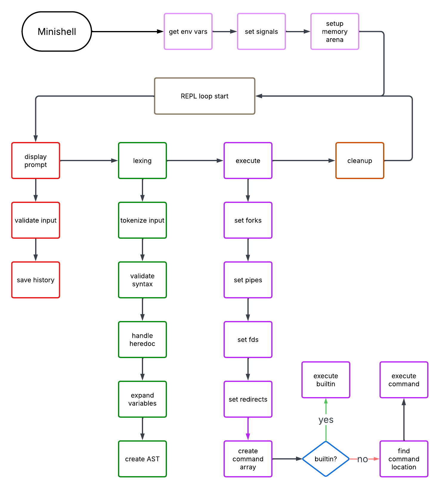

# Minishell

<h3 align="left">✨ 𝒜𝓈 𝒷𝑒𝒶𝓊𝓉𝒾𝒻𝓊𝓁 𝒶𝓈 𝒶 𝓈𝒽𝑒𝓁𝓁 ✨</h3>

## 📌 Overview

Minishell is a simple Unix shell implementation written in C. This project aims to deepen the understanding of process management, file descriptors, and system calls.

## 🌟 Features

- **Interactive shell**: Custom prompt, command history, tab completion, input validation
- **Command execution**: Absolute/relative paths, `$PATH` lookup, pipe chaining `|`
- **I/O redirections**: (`<`, `>`, `<<`, `>>`)
- **Quote handling**: Single quotes (`'`) literal, double quotes (`"`) with variable expansion, nested protection
- **Variable management**: Environment expansion (`$VAR`), exit status (`$?`) and process ID (`$$`), assignment/export
- **Built-in commands**:
  - `echo` (with `-n` option)
  - `cd` (with relative/absolute paths)
  - `pwd`
  - `export`
  - `unset`
  - `env`
  - `exit`
- **Signal handling**: (interrupt) `Ctrl-C` , (exit) `Ctrl-D`, (quit with core dump) `Ctrl-\`


## ▶️ Run

### Compilation
```bash
git clone https://github.com/vallucodes/minishell.git
cd minishell
make
```
### Run
```bash
./minishell
```

## ⏩ Example usage

```bash
🦒 >>> Giraffeshell>$ echo Hello World
Hello World

🦒 >>> Giraffeshell>$ export NAME=42
🦒 >>> Giraffeshell>$ echo $NAME
42

🦒 >>> Giraffeshell>$ ls | grep .c > out.txt
🦒 >>> Giraffeshell>$ cat < out.txt | wc -l
2
```

## 📦 Dependencies

- Readline

## 🛠️ Technical Implementation

| Component   | Details   |
|-----|----------|
| Terminal Interface | `readline` library integration for command history and line editing |
| Lexical Analyzer| Custom tokenizer with state machine for parsing quotes, operators, and whitespace  |
| Parser Architecture | Parser building Abstract Syntax Tree (AST) |
| Heredoc Implementation | Custom parsing creates temporary files as input sources for `<<` operator |
| Process Management | `fork()`, `execve()`, `wait()` for child process creation and monitoring |
| Command Resolution | Path traversal algorithm for executable lookup in `$PATH` directories |
| Inter-Process Communication  | `pipe()` system calls for command chaining with file descriptor management |
| Memory management  | Arena-based allocation for each command parsing and execution with `malloc()` for environment variables, stack memory usage for the rest |
| Signal Architecture | Custom signal handlers using `signal()` for clean interrupt handling |
| Environment Handling | Environment handling with built-it implementations `env()`, `export()` and `unset()` |
| Library | Custom library `libft` integration |
| Error Handling | Comprehensive error checking with exit codes and error messages matching bash behaviour |

## 🏗️ Architecture Overview



## 👥 Creators

- [Vladimir Lopatinski](https://github.com/vallucodes)
- [Hien Nguyen](https://github.com/novth17)
